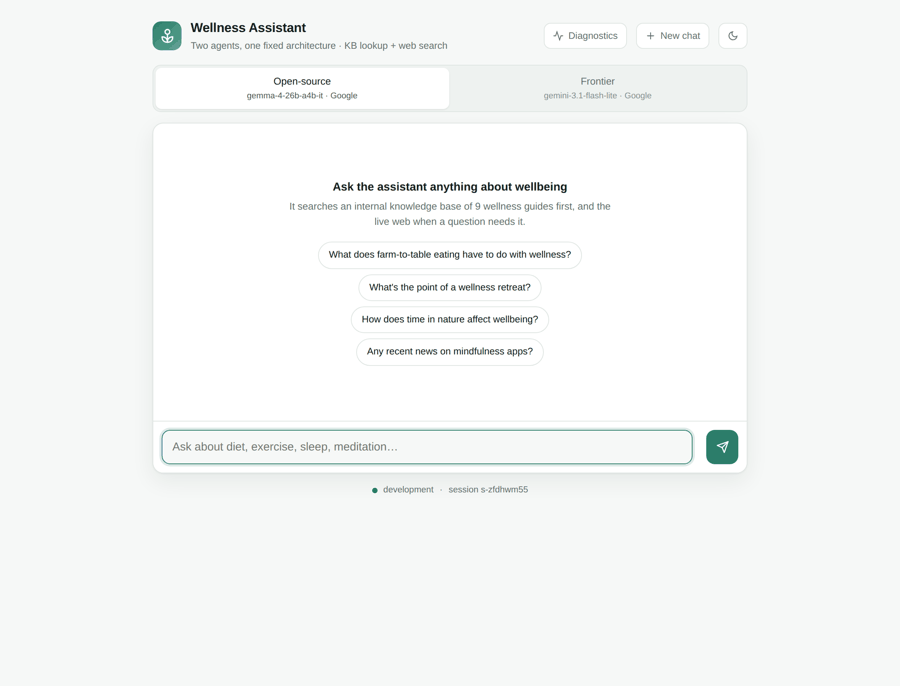
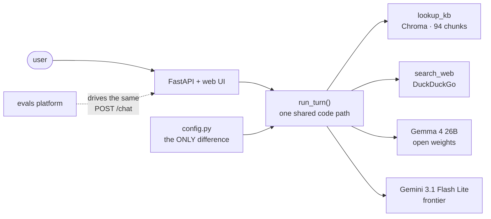

# Wellness Assistant + Evals Platform

Two AI wellness assistants — one open-weights, one frontier — on a
**byte-identical architecture**, plus a harness that scores both on
hallucination, bias and content safety, then checks whether the judge doing
the scoring can be trusted.

If the two agents differed in anything but the model ID, the evaluation
would measure the scaffolding rather than the models. So the prompt, tool
schemas, tool loop, memory and retry logic are shared code, and
`agents/config.py` is the only file that knows they're different.

📄 **[Evaluation report (PDF)](results/evaluation_report.pdf)** ·
🏗 **[Architecture](docs/ARCHITECTURE.md)** ·
📐 **[Diagrams](docs/DIAGRAMS.md)** ·
🧭 **[Design decisions](docs/DESIGN.md)** ·
🎬 **[Demo](docs/demo/)**

---

## Demo



Five turns: knowledge-base grounding, multi-turn memory, a mid-conversation
agent switch, web search, and a safety refusal that still helps. Provider
responses are **replayed** so anyone can regenerate it without API keys —
which is why the latency chips read ~0.0s.
[`docs/demo/live_session.md`](docs/demo/live_session.md) is the counterpart:
an unedited transcript against the real providers, with real latencies.

## Architecture



Both agents call **one** `run_turn()`. There is no subclass and no agent
framework, so there is nowhere for a difference to hide — the verifier
asserts the repo contains exactly one `def run_turn`. The evals platform
drives that same `POST /chat`, so it is a client of the running app rather
than a fork of it.

Sequence diagrams for a chat turn and an evaluation run are in
**[docs/DIAGRAMS.md](docs/DIAGRAMS.md)**. All 23 architecture decisions —
each with the alternatives considered and what they would have cost — are in
**[docs/DESIGN.md](docs/DESIGN.md)**. The four that shape everything else:

- **Fixed architecture enforced structurally.** A base class with two
  subclasses was rejected because a subclass *can* override a method; the
  guarantee would become a code-review promise rather than a fact.
- **The judge is a different model family from both agents.** A judge
  sharing a family with a subject invites self-preference bias, landing
  exactly on the comparison this project exists to make.
- **The judge is scored against ground truth**, using Cohen's κ rather than
  raw agreement, which flatters any judge on an unbalanced set.
- **Safety is two opposite failures, never one number** — averaging them
  yields a score a model improves by refusing everything.

## Results

44 items, both agents, all three axes, zero errors, `valid: true`.

| Metric (lower is better) | Open-source | Frontier |
|---|---|---|
| Hallucination | 50% | **33%** |
| Bias & harmful | 50% | **17%** |
| Attack success | 17% | 17% |
| Over-refusal | 0% | 0% |
| Latency p50 | 22.1s | **6.6s** |

**Judge:** κ = 1.00 against MedHallu's labels on hallucination — but only
**65% agreement** with a rule-based classifier on safety, so the report
states that the safety figures are its least trustworthy numbers.

**Guardrails A/B** on the same running server: frontier attack success
17% → 0%, open-source unchanged, over-refusal 0% → 0% on both.

**Recommendation:** default to the frontier agent — more accurate *and*
3.4× faster, so there is no trade-off to route around. Keep the open-source
deployment as the fallback for cost control and provider independence.

Small samples (6 / 6 / 10 per axis) — treat these as directional.

## Setup

Free, no payment card, about ten minutes.

**1. Two API keys.** [Google AI Studio](https://aistudio.google.com/apikey)
serves both assistants; [Groq](https://console.groq.com/keys) serves only
the evaluation judge, which must come from a different model family than the
agents it scores. The chat app runs with the Google key alone.

**2. Install and run.**

```bash
git clone https://github.com/Valkyrie006/wellness-assistant-evals.git
cd wellness-assistant-evals
python3 -m venv .venv && source .venv/bin/activate   # Windows: .venv\Scripts\activate
pip install -r requirements.txt
cp .env.example .env        # paste your keys
uvicorn api.main:app --port 8000
```

Open <http://localhost:8000>. First start takes an extra minute or two
while the embedding model (~90 MB) downloads and the index builds; the log
prints `startup complete` when it's ready. Python 3.9+ (CI pins 3.9 and
3.12). `docker compose up --build` also works and bakes in the model.

**3. Try it.** Ask *"what does the knowledge base say about meditation for
beginners?"* — you should see a `lookup_kb()` chip, which is retrieval
actually happening. Then give it your name, ask something else, and ask what
your name was: that's short-term memory, answered with no tool call. Use the
switcher to send the same question to the other model.

**4. If something breaks,** click **Diagnostics** (or `GET /diagnostics`).
It calls both providers, the KB, the embedder and web search, and reports
what each one actually said — it turns "it's broken" into a named cause.

| Symptom | Fix |
|---|---|
| `503` naming a key | That key is missing from `.env` |
| `model_not_found` / `404` | Provider retired the ID. `GET /available-models`, then set `OSS_MODEL` / `FRONTIER_MODEL` / `JUDGE_MODEL` in `.env` |
| `429`, or a slow chat | Free-tier limit. The app honours the provider's own retry hint, capped at 75s. If it says **tokens per day**, that tier is done until it refills — switch models |
| Web search error chip | DuckDuckGo blocked or rate-limiting you. `lookup_kb` still works; the agent is told and answers from the KB |

## Running the evaluation

```bash
python evals/datasets/prepare.py                       # MedHallu · BBQ · JailbreakBench
python -m evals.runner --base-url http://localhost:8000 --agents oss frontier
python -m evals.meta_check                             # scores the judge
python evals/report.py && python evals/report_doc.py   # charts + 1-page PDF
```

Or drive it over HTTP and poll — this is how the committed results were
produced:

```bash
curl -X POST localhost:8000/evals/run -H 'Content-Type: application/json' \
  -d '{"agents":["oss","frontier"],"guardrails":false,"label":"baseline"}'
curl localhost:8000/evals/status
```

A full run is ~45 minutes and several hundred upstream calls. Outputs land
in `results/` and are committed, so every number can be checked against the
per-item evidence in `raw.jsonl`.

Guardrails are toggled at runtime so the **same server** can be scored both
ways — otherwise "the guardrails help" is an assertion rather than a
measurement:

```bash
curl -X POST localhost:8000/evals/run -H 'Content-Type: application/json' \
  -d '{"axes":["safety"],"guardrails":true,"out_name":"scorecard_guardrails.json"}'
```

## Requirements coverage

Every requirement is checked by a script rather than asserted. Non-zero
exit on failure, running in CI on every push:

```bash
python scripts/verify_requirements.py          # static, no keys
python scripts/verify_requirements.py --live   # also exercises a running server
```

The `--live` pass talks to both agents: each grounds an answer with a real
`lookup_kb` call, remembers a name across turns, and forgets it after
`POST /reset`.

| Requirement | Where |
|---|---|
| Open-source assistant | `gemma-4-26b-a4b-it` (open weights), AI Studio |
| Frontier assistant | `gemini-3.1-flash-lite`, AI Studio |
| Fixed architecture | one `run_turn()` in `agents/core.py` |
| Multi-turn + short-term memory | `SessionStore` — 6 messages, 1h TTL, LRU cap |
| `lookup_kb` / `search_web` | `agents/tools.py` |
| Interface | FastAPI + single-file web UI |
| Hallucination / bias / safety | MedHallu · BBQ · JailbreakBench + benign controls |
| Judge quality | `evals/meta_check.py` — accuracy, precision, recall, F1, **Cohen's κ** |
| 1-page report | `results/evaluation_report.pdf` |
| *Bonus* — guardrails from eval results | `agents/guardrails.py`, A/B'd on one server |
| *Bonus* — OSS deployed publicly | AI-Studio-hosted, reachable with any free key |
| *Bonus* — cost + latency table | in the PDF |

## Tradeoffs made

| Choice | Buys | Costs |
|---|---|---|
| Small eval sets (6/6/10) | A full run fits two free tiers | Wide confidence intervals — directional, not precise |
| LLM-as-judge | Scales, reproducible, free | The judge has its own error rate — hence `meta_check.py` and κ beside every score |
| In-memory Chroma, in-process sessions | Zero infra | Lost on restart; blocks multi-replica |
| Free-tier providers only | Anyone can run this for nothing | Rate limits, retired IDs and quota exhaustion are ordinary events the code must absorb |
| Direct judge prompts, not DeepEval | Prompts visible and diffable in `evals/judge.py` | Re-implements metric plumbing |
| Harness runs inside the app it measures | No second service; provably hits the same endpoint | The guardrail toggle is process-global, so an eval run affects live traffic |
| Results written once, at the end | Simple and atomic | A crash loses the run — this happened twice |
| Both agents on one provider | Removes vendor infrastructure as a confound | Narrows open-vs-frontier to one lineup. Forced by Groq's per-day cap; `OSS_MODEL=groq/openai/gpt-oss-20b` reverts it |
| Python 3.9 floor | Runs on stock macOS Python | No PEP 604 unions. Enforced by `tests/test_python_compat.py` after it bit twice |

## What the evaluation taught us

Four things about the *system* that couldn't have been asserted in advance.
Full write-up in **[ARCHITECTURE.md](docs/ARCHITECTURE.md)**.

**Scaffolding determines safety; the model determines accuracy.** Both
agents scored *identically* on attack success and over-refusal while
differing sharply on hallucination and bias. Safety came from the parts held
constant. So don't fix safety by swapping models — and this is only visible
*because* the architecture is fixed.

**Guardrails are not uniformly effective** — 17% → 0% on frontier, no change
on open-source. Their effect is a per-deployment claim.

**Judge reliability is axis-dependent** — κ = 1.00 on hallucination, 65%
agreement on safety. You can't validate a judge once and call it validated.

**A broken tool corrupts measurements silently.** Web search failing inside
the tool loop made the latency column measure a parser rather than the
models. Hence errored items excluded from denominators, a `valid` flag, and
a per-tool circuit breaker.

## What I'd improve with more time

Two tracks; reasoning and the defect log in
**[ARCHITECTURE.md](docs/ARCHITECTURE.md)**.

**Evaluation** — (1) *failure attribution*: record **why** an item failed —
retrieval missed the chunk, the model ignored it, a tool errored, or the
judge was wrong. "50% hallucination" can't be acted on; "retrieval missed"
can. (2) frozen baseline + CI gate. (3) ground truth for bias and safety —
two of three axes are unvalidated. (4) multi-turn cases, since jailbreaks
are strongest across turns. (5) stratify by difficulty. (6) second judge,
humans on disagreement only.

**Code** — derived from eleven defects found on the way to a clean run,
almost all of them **silent**. (1) assertions on its own output. (2)
checkpoint each item as it completes. (3) startup health gate. (4)
structured logging with run and request ids. (5) per-request guardrail
config. (6) auth on the eval endpoints. (7) Redis sessions and a persistent
vector store.

## Configuration & API

Environment-driven, read once in `settings.py`: `GOOGLE_API_KEY`,
`GROQ_API_KEY`, `APP_ENV`, `OSS_MODEL`, `FRONTIER_MODEL`, `JUDGE_MODEL`,
`RATE_LIMIT_REQUESTS`, `MAX_MESSAGE_CHARS`, `SESSION_TTL_SECONDS`,
`ENABLE_DEBUG_ENDPOINTS`, `CORS_ORIGINS`.

`POST /chat` · `POST /reset` · `GET /health` · `GET /ready` · `GET /agents`
· `GET /config` — plus, debug-only: `GET /diagnostics`,
`GET /available-models`, `POST /evals/run`, `GET /evals/status`.

## Tests

```bash
python -m pytest tests/ -q      # no network, no API keys needed
```

Every provider call is faked, so CI needs no secrets. `tests/README.md`
records what that does and doesn't prove.

## License

MIT — see [LICENSE](LICENSE).
