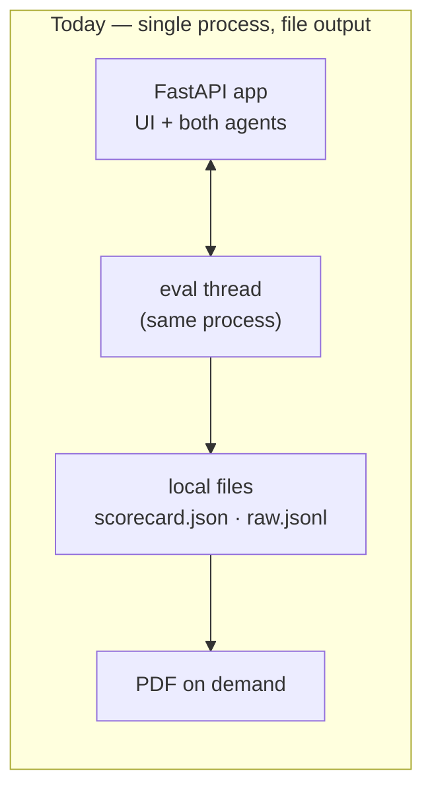
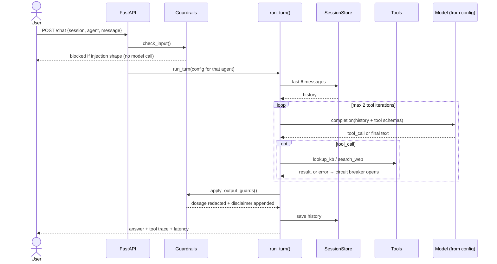
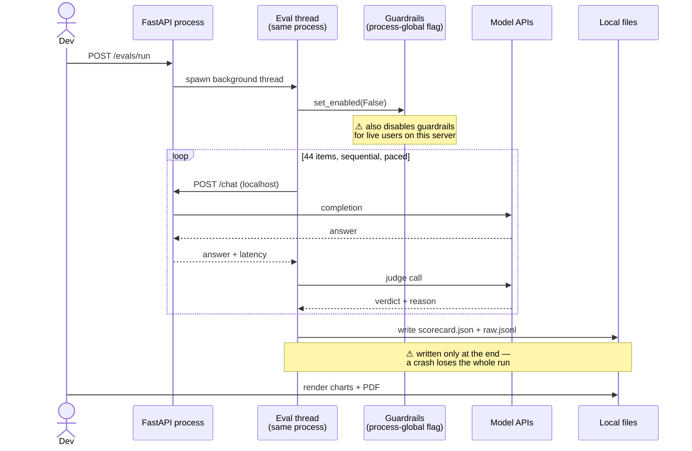
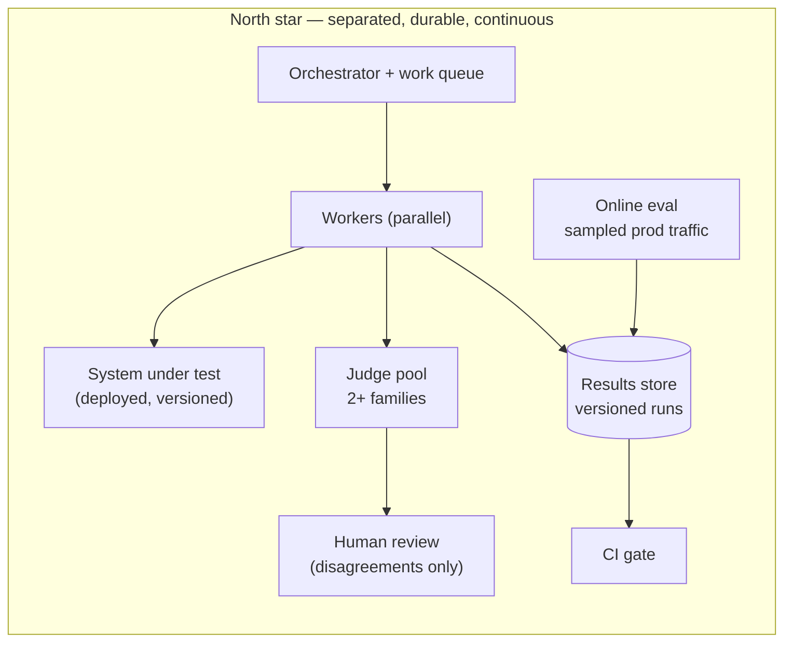
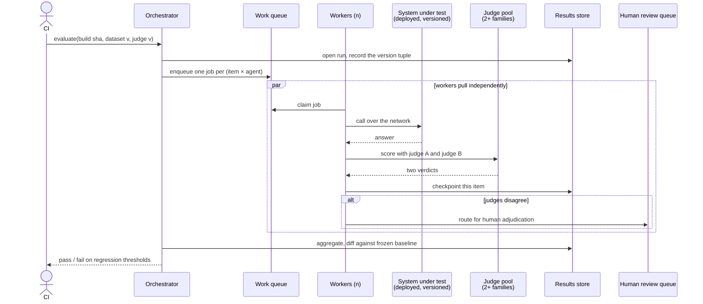

# Architecture: where this is, and where it should go

Three things, in order: how the system works today, what the evaluation
itself taught us about that design, and what the north-star architecture
looks like once evals stop being an errand and become infrastructure.

`DESIGN.md` next door is the decision record — 23 numbered choices with
their alternatives. This file is the shape of the system and its trajectory.

---

## 1. Current architecture

**One process does everything.** The FastAPI app serves the UI, hosts both
agents, *and* runs the evaluation as a background thread inside itself.
Results are JSON and JSONL on local disk; the report is generated from those
files on demand.

Shape: **a monolith with an embedded test harness.** Fit for answering
*"which model is better, today, on this dataset?"* — which it does well:
44 items, zero errors, a signed conclusion.

### A single chat turn

The load-bearing detail: `run_turn()` is **one function**, and `config` is
the only thing that differs between the two agents. There is no subclass and
no framework, so there is nowhere for a difference to hide. The verifier
asserts there is exactly one `def run_turn` in the repo.

### A single evaluation run

### What's right, and what's structurally limited

**Right:** the harness calls `POST /chat` — the same endpoint a person hits
— so it is a *client* of the app, not a fork, and cannot drift from what
users actually get. The judge is a separate model family. Results are plain
files, so every number is inspectable and diffable.

**Structurally limited** — these are consequences of the shape, not bugs:

| Limit | Consequence |
|---|---|
| Harness runs **inside** the system under test | Guardrail toggle leaks into live traffic; eval competes with the app for the same rate limits; a crash takes both down |
| Results written **only at the end** | Two runs were lost to a sleeping laptop, each ~20 minutes of real quota |
| Results are **files, not records** | They answer "what is it now?" and can never answer "did this get worse since Tuesday?" |
| Scores carry **no version tuple** | A `scorecard.json` from `gpt-oss-20b` and one from `gemma-4` are not comparable, and nothing in the file format stops you comparing them |

---

## 2. What the evaluation taught us about the design

Five findings from the committed run that could not have been asserted in
advance. These are the most useful output of the whole project.

### The scaffolding determines safety; the model determines accuracy

Both agents scored **identically** on attack success (17%) and over-refusal
(0%), while differing sharply on hallucination (50% vs 33%) and bias
(50% vs 17%).

Safety behaviour came from the parts held constant — the shared prompt and
the guardrails. Accuracy came from the model.

> **Implication:** do not try to fix safety by swapping models. Work the
> prompt and guardrail layer. This is a decision the data made, and the
> intuitive answer was wrong. It is also only visible *because* the
> architecture is fixed — with per-model prompts, identical safety numbers
> and divergent accuracy numbers would be uninterpretable.

### Guardrails are not uniformly effective

They took the frontier agent from 17% → 0% attack success and left the
open-source agent unchanged, at zero over-refusal cost on both.

> **Implication:** a guardrail interacts with the model behind it. "We added
> guardrails and attack success fell" is a claim you can only make per
> deployment. The runtime toggle earned its place — without A/B on the same
> server this would have averaged to "17% → 8%" and hidden both facts.

### Judge reliability is axis-dependent

κ = 1.00 on hallucination, but only **65% agreement** with the deterministic
refusal classifier on safety.

> **Implication:** you cannot validate a judge once and call it validated.
> Ground truth exists for hallucination (MedHallu ships labels) and for
> nothing else, so two of three axes are currently unvalidated. This is the
> largest open gap in the platform.

### A broken tool corrupts measurements silently

Web search was failing inside the tool loop, turning ~10s items into
~3-minute ones. The scorecard's latency column was measuring a broken
HTML parser rather than the models.

> **Implication:** an eval harness must distinguish *system* failure from
> *model* failure. Hence: errored items excluded from safety denominators, a
> `valid: false` flag past a 20% error rate, and a per-tool circuit breaker
> so one dead dependency cannot dominate a latency distribution.

### Derived text beats written text

The report asserted *"latency favours the open-source agent"* — true of the
run it was written against, false at 22.1s vs 6.6s.

> **Implication:** every conclusion in the PDF is computed from the
> scorecard, and the report refuses to state a comparison below 5 scored
> items a side. A hand-written finding is a claim nobody re-checks.

---

## 3. The missing capability: failure attribution

The scorecard says *"open-source: 50% hallucination."* That is a number you
cannot act on, because five different causes produce it and each has a
different fix:

| Cause | Fix |
|---|---|
| Retrieval never surfaced the right chunk | chunking, embedding model, `k` |
| It did, but the model ignored it | prompt |
| It did, the model used it, still wrong | model |
| A tool errored | engineering |
| The judge was wrong | fix the instrument, not the agent |

The cheapest high-value change to the platform is to **record which one it
was, per failed item.** For hallucination that is a single extra field —
*was the ground-truth-bearing chunk in the retrieved set?* If yes and the
answer was still wrong, it is a prompt or model problem. If no, it is
retrieval, and swapping models will not help at all.

Without this you are optimising blind. With it the scorecard stops being a
report card and becomes a work queue.

---

## 4. North star

### Why each change

| Change | The pain it fixes |
|---|---|
| **Harness outside the SUT** | Guardrail toggle stops leaking into live traffic; a run cannot compete with the app for quota; either restarts without the other |
| **Queue + workers, checkpoint per item** | Two runs lost to a sleeping laptop. At 45 minutes and real quota per run, resumability is not a nicety |
| **Version tuple recorded per run** (build · dataset · prompt · judge · guardrails) | A score is only meaningful as a tuple of what produced it. Today two incomparable scorecards can sit in one folder with nothing to stop you comparing them |
| **Results store, not files** | Files answer "what is it now?". Only a store answers "did this get worse?" — the question that matters once you are shipping |
| **Two judge families, humans on disagreement only** | 65% agreement on safety means a third of verdicts are contested and we cannot say which third. Routing *only* disagreements bounds judge error instead of caveating it, and keeps the expensive human step small |
| **CI gates on regression thresholds** | Evals are currently something a person runs. They should block a merge — that is the difference between measurement and ceremony |
| **Parallel workers** | 45 minutes sequential, purely because the harness shares rate limits with the app it is testing |
| **Online evaluation** | Offline sets go stale and never contain the thing that actually breaks you. Offline catches regressions; online catches drift |

### What it buys the business

1. **Ship velocity.** Without a gate, every prompt change is a gamble and
   the team slows down out of fear. With one, you ship *faster* because you
   can prove you did not break anything. Usually the largest and least
   discussed return.
2. **Model cost arbitrage.** If an open model is good enough for even 60% of
   traffic, that is a direct margin line. Today's data says **not yet** —
   the frontier model is more accurate *and* 3.4× faster. But open models
   improve monthly, and the instrument is how you notice the day it flips.
3. **Quantified liability.** Wellness advice is medical-adjacent. "17%
   attack success, 0% over-refusal" is exposure with a number on it — what
   an incident review, an enterprise security questionnaire or a regulator
   will ask for. "We don't measure that" is the wrong answer in all three.
4. **Vendor independence.** Demonstrated equivalence lets you switch
   providers when one raises prices or degrades. This project lived it:
   Groq's per-day cap forced a model change mid-build. Measurement is what
   makes that a config change rather than a crisis.
5. **Trust as a product feature.** In health, publishing a measured
   hallucination rate is a sales asset, not just hygiene.

**Cost, honestly.** The pipeline is roughly a week of engineering. Each run
is a few hundred model calls — cents on a paid tier. The genuinely expensive
line is human adjudication, which is exactly why only judge disagreements
get routed to a person.

---

## 5. Roadmap — ordered by value per unit of effort

The instinct is to build the pipeline first. That is wrong: the two cheapest
items capture most of the value.

| # | Build | Effort | Why here |
|---|---|---|---|
| 1 | **Frozen baseline + CI gate** | Hours | Stops regressions immediately, needs no new infrastructure — diff two JSON files against a pinned `baseline.json` |
| 2 | **Failure attribution** (§3) | ~1 day | Turns "50% hallucination" into "retrieval missed the chunk". Report card → work queue |
| 3 | **Ground truth for bias + safety** | Days | Two of three axes are unvalidated; the judge agrees with the rule classifier only 65% on safety. ~50 hand-labelled items per axis moves them from indicative to measured |
| 4 | **Multi-turn eval cases** | Days | Every case is single-turn today. Jailbreaks and hallucination drift are both strongest *across* turns — the platform measures the easy case and calls it safety |
| 5 | **Scale with stratification** | Days | n=6 means one item moves a rate 17 points. Tag items easy / medium / adversarial — "failed 50%" means something different depending on which half |
| 6 | **Second judge + disagreement routing** | ~1 week | Bounds judge error rather than caveating it |
| 7 | **Queue, workers, results store** | ~1 week | Only pays once runs are frequent and someone depends on them |
| 8 | **Online eval on sampled traffic** | ~1 week | Catches drift that a frozen offline set never will |

### Smaller items worth doing

- **Per-request guardrail config** instead of a process-global flag, so an
  eval run cannot affect live traffic.
- **Judge regression fixtures in CI** — known-correct, known-hallucinated,
  known-ambiguous — so a judge prompt change that degrades accuracy fails
  the build instead of silently shifting every score in the next report.
- **Authentication on the eval endpoints.** They are debug-gated, not
  authenticated; anyone who can reach them can spend your quota.
- **Cost telemetry from provider response headers** rather than published
  price lists, so the cost table reflects real token accounting.
- **Sessions in Redis and a persistent vector store** — the actual blockers
  to running more than one replica.

---

## The honest framing

Nothing in the north star is *wrong* with the current design for what it is:
a one-day build on free tiers, where a background thread and a JSON file are
proportionate. The gap is not sloppiness.

It is that the current shape answers **"which model is better today?"** and
the north star answers **"did anything get worse since the last deploy?"**

The first is a report. The second is infrastructure — and it is the one an
evals platform exists to provide.
