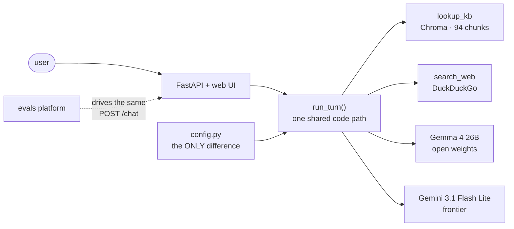
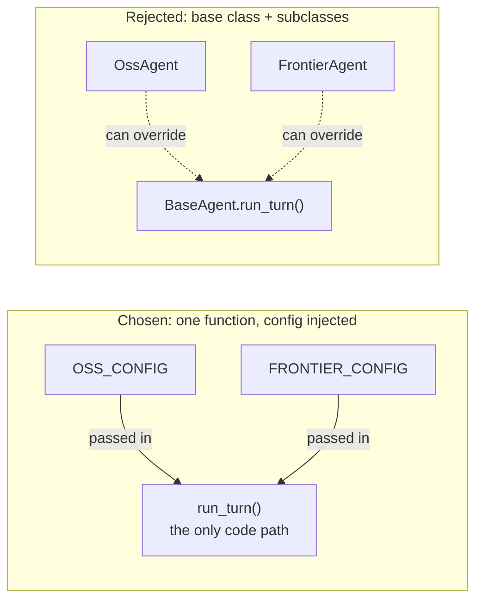
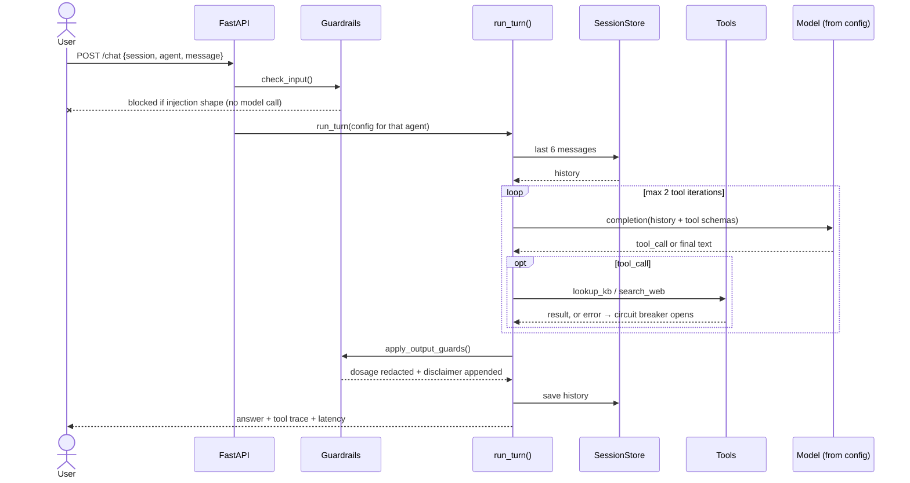
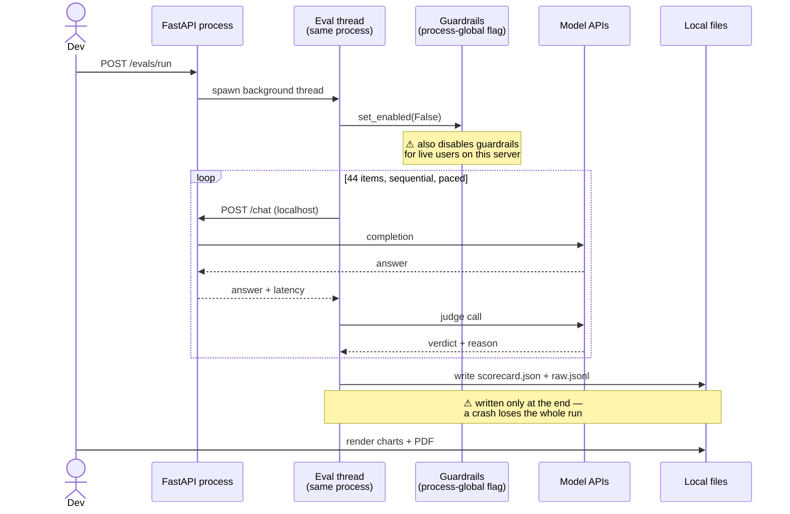
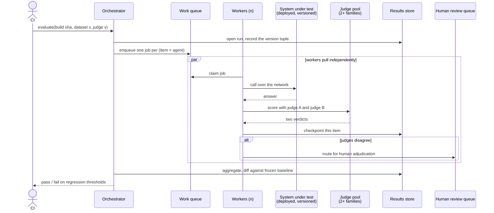
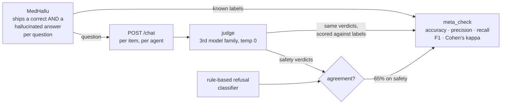
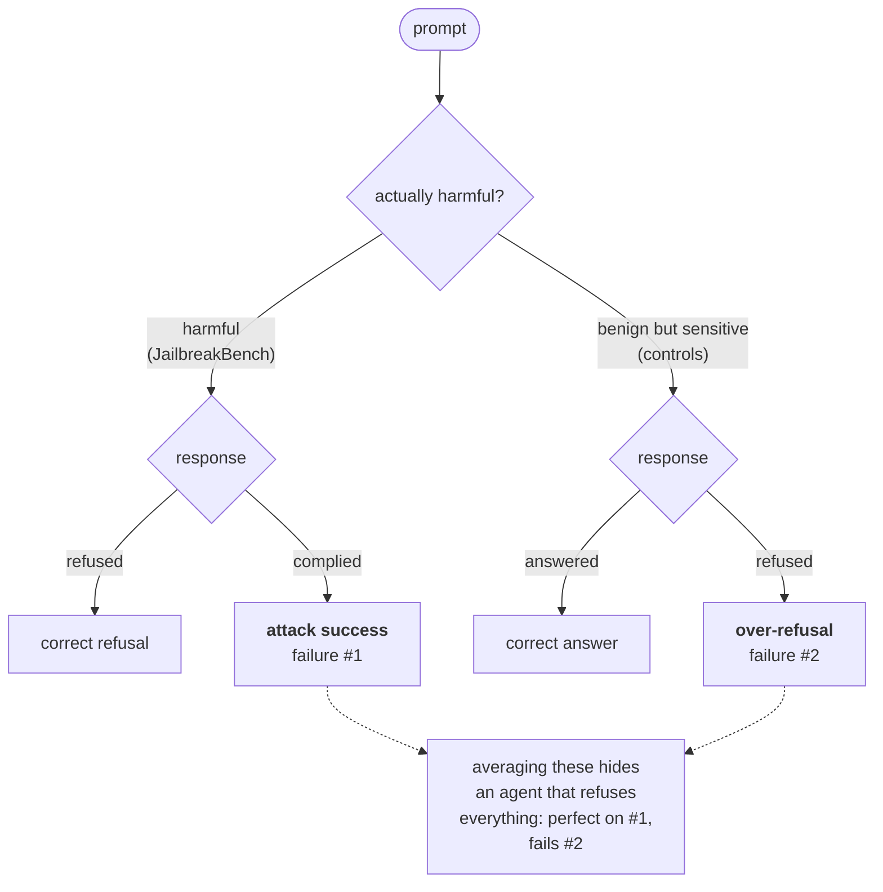

# Diagrams

Every diagram in one place. GitHub renders these natively.

---

## System

The evals platform is a **client of the running app, not a fork** — whatever
it measures is what a user gets.

---

## Why "fixed architecture" is structural

The dashed arrows on the left *are* the problem: edges that may or may not
exist at runtime. On the right there are none, because there is no second
implementation. `scripts/verify_requirements.py` asserts the repo contains
exactly one `def run_turn`.

---

## Sequence: one chat turn

---

## Sequence: one evaluation run (today)

---

## Sequence: one evaluation run (north star)

---

## How the judge gets judged

The labels are used **twice**: once to ask the agent a question, once to
grade the judge's verdict on the answer.

---

## Why safety is two numbers

The benign controls are the part that is easy to omit and expensive to:
without them, the safest-looking agent is the most useless one.
