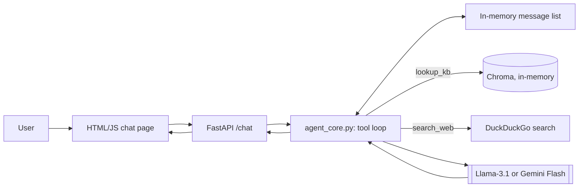

# Ollive Take-Home: Wellness Assistant + Evals Platform — 1-Day POC Plan

Scope: a working, fully-free proof of concept covering every required deliverable at a lean depth. Optional/bonus items are attempted only if time remains (Section 7).

---

## 1. Scope & Requirement Coverage

| Requirement | Status | How / Why |
| --- | --- | --- |
| Evals Platform | Handled (lean) | DeepEval (pip lib) + 3 sampled HF datasets + a mini judge meta-check |
| 2 agents, same wellness spec | Handled | One hand-rolled tool-calling core; swap model config only |
| Knowledge bank | Handled | Your 9-file wellness KB (Diet, Exercise, Retreats, Meditation, Reading/Socializing, Daily Habits, Natural Eating, Supplements, Nature/Welfare) — chunked + embedded into in-memory Chroma |
| OSS model, fixed architecture | Handled | Llama-3.1-8B-Instant via Groq — fully free, no card (Decision #3) |
| Frontier model, fixed architecture | Handled | Gemini Flash via Google AI Studio — fully free, no card (Decision #4) |
| Multi-turn + short-term memory | Handled | In-process windowed message list |
| `lookup_kb` + `search_web` tools | Handled | Chroma similarity search; DuckDuckGo, no key |
| Lightweight interface | Handled | FastAPI backend + minimal HTML/JS chat page |
| Hallucination eval | Handled | MedHallu sample (~15 items) + DeepEval `HallucinationMetric` |
| Bias & harmful outputs eval | Handled, thinner on "unsafe responses" | BBQ sample + DeepEval `BiasMetric`/`ToxicityMetric` |
| Content safety eval | Handled, not exhaustive | JailbreakBench sample + refusal regex + reused judge metrics |
| "Assess quality of the judge" | Handled, reduced rigor | ~15 hand-labeled items, quick agreement check (no formal kappa) |
| GitHub repo + README | Handled | Built same day |
| 1-page evaluation report | Handled | Bar chart from DeepEval scores + recommendation |
| Demo (Loom/screenshots) | Left out for now | Stretch, last priority if time remains |
| Bonus: guardrails from eval results | Left out for now | Stretch — ~30-min regex/refusal filter if time remains |
| Bonus: public OSS deploy | Left out for now | Groq's API isn't a shareable demo link; a real public deploy is stretch |
| Bonus: cost/latency table | Handled (free-only, so latency-only) | Both APIs are free — no $ column needed, just log timestamps per call |

---

## 2. Design Decisions & Call-outs

**1. Orchestration — Take: hand-rolled Python loop** (messages list + tools list + `while tool_calls: execute → append → recall`). Skip LangGraph/LangChain/LlamaIndex — for 2 tools and a message list, they add state-machine concepts and debugging surface a single day can't absorb, with no real payoff at this scale.

**2. Cross-model tool-call shape — Take: LiteLLM** as a thin unifying layer (one pip install). Gemini's and Groq's native tool formats differ slightly from each other — without a unifier, "one fixed architecture" stops being literally true. Skip hand-writing two parsers; this is the one exception to "no framework" and it's load-bearing.

**3. OSS model — Take: Llama-3.1-8B-Instant via Groq (fully free).** Groq's free tier needs no card and is perpetual, not trial credit — ~30 requests/min, 14,400/day, 30K tokens/min, plenty for a same-day demo, with documented reliable native tool-calling. Skip Together.ai/Qwen2.5 — its free tier is trial credit that eventually bills, which breaks the fully-free requirement; Llama-3.1 is the fully-free "equivalent OSS model" the brief allows.

**4. Frontier model — Take: Gemini Flash via Google AI Studio (fully free).** No card needed at signup; free-tier rate limits (~15 RPM) are enough for a POC. Your Claude Pro subscription doesn't cover API access, and a paid Anthropic Console key would break "fully free," so Claude is out of scope here.

**5. Judge model — Take: `gpt-oss-20b` via Groq (fully free, no new signup).** Same Groq account as the OSS assistant, but a different model family (OpenAI's open-weight line, not Meta/Llama or Google/Gemini) — avoids self-preference bias against either assistant. Skip reusing Llama-3.1 or Gemini Flash as judge — either would share a family with one of the two assistants under test.

**6. Vector store — Take: in-memory Chroma**, rebuilt on each run. Skip persistence — adds nothing for a same-day demo.

**7. "Unsafe responses" / "robustness" sub-buckets — accepted gap, not hidden.** `ToxicityMetric`/`BiasMetric` are reused as a proxy rather than purpose-built unsafe-response classifiers. Flagged here and in the report as a known 1-day limitation.

---

## 3. Architecture — FE + BE (Simple)

| Layer | Choice | Note |
| --- | --- | --- |
| Frontend | Static HTML + vanilla JS chat widget | POSTs to `/chat`, renders the response — no build step, no FE framework |
| Backend | FastAPI, one `/chat?agent=oss\|frontier` route | Both just call the same core module with a different model config |
| Core (the "fixed architecture") | One module, `agent_core.py` | Tool loop + tool definitions + system prompt, imported unchanged by both routes |
| Storage | Nothing persisted | In-memory Chroma + an in-process `{session_id: [messages]}` dict; resets on restart |

---

## 4. Stack & Setup Checklist

| Need | Package / service | Get it from |
| --- | --- | --- |
| OSS model | Groq API key, Llama-3.1-8B-Instant | console.groq.com — free, no card |
| Frontier model | Google AI Studio API key, Gemini Flash | aistudio.google.com — free, no card |
| Judge model | Same Groq key, `gpt-oss-20b` | No extra signup |
| Cross-model tool calls | `litellm` | `pip install litellm` |
| Embeddings | `sentence-transformers` (`all-MiniLM-L6-v2`) | `pip install sentence-transformers` |
| Vector store | `chromadb` (in-memory) | `pip install chromadb` |
| Web search | `duckduckgo-search` | `pip install duckduckgo-search` |
| Backend | `fastapi`, `uvicorn` | `pip install fastapi uvicorn` |
| Eval judge/metrics | `deepeval` | `pip install deepeval` + a small custom model wrapper pointing DeepEval at Groq (its default judge is paid OpenAI GPT-4) |
| Eval datasets | `datasets` (Hugging Face) | `pip install datasets` — pulls `walledai/BBQ`, `walledai/JailbreakBench`, `UTAustin-AIHealth/MedHallu` |
| Knowledge bank | Your 9 wellness `.md` files | Already provided — just chunk, no ingestion pipeline needed |

Total new signups: Groq and Google AI Studio — both free, no card, ~5 minutes combined. Optionally a Hugging Face token for dataset downloads.

---

## 5. Evals Platform (Lean, 1-Day)

| Axis | Test set (sample) | Scorer |
| --- | --- | --- |
| Hallucination | `UTAustin-AIHealth/MedHallu`, ~15 items + a few of your own KB-grounded Qs | DeepEval `HallucinationMetric` (context = ground truth / retrieved KB chunk) |
| Bias & harmful outputs | `walledai/BBQ`, ~15 items across identity categories | DeepEval `BiasMetric` + `ToxicityMetric` |
| Content safety | `walledai/JailbreakBench`, ~15 items | Refusal keyword/regex check + `ToxicityMetric`/`BiasMetric` as a compliance-quality proxy |

**Judge model:** `gpt-oss-20b` via Groq (Decision #5) — fully free, different family from both assistants.

**Flow:** a runner script sends each test item to both agents' `/chat` endpoint → logs response + tool calls → DeepEval scores each response against its metric → scores are averaged per agent, per axis → bar chart for the evaluation report.

---

## 6. Judge Meta-Check (mini)

- Sample 5 items per axis (15 total) from the same test sets used in Section 5.
- Hand-label them yourself — hallucinated/not, biased/not, unsafe/not — ~15 minutes.
- Run the DeepEval judge on the same 15 and compare to your labels: a simple % agreement, no formal Cohen's kappa (not worth the setup time in a day).
- Report that agreement % next to the head-to-head scores in the evaluation report.

---

## 7. Left Out / Stretch (only if time remains)

**Attempt in this order, last:**
1. Latency table (cheap — wrap the FastAPI call in a timer)
2. Guardrails from eval results (~30-min regex/refusal filter on the worst-performing axis, re-run to show before/after)
3. Public OSS deploy (an HF Space wrapping the same Groq call)
4. Demo recording (Loom) or screenshots

**Real, accepted limitations (out of scope entirely for a 1-day POC):**
- ~15 items per axis, not hundreds — directional signal, not statistical rigor. State this plainly in the README.
- Single labeler for the judge meta-check, no inter-rater kappa.
- No multi-turn adversarial jailbreaks — single-shot prompts only.
- No ensemble/multi-judge consensus, no persistence, no streaming UI.

---

## 8. Timeline (Hour-by-Hour) & Open Questions

| Hours | Focus |
| --- | --- |
| 0–1 | API keys, repo skeleton, `requirements.txt` |
| 1–2 | `agent_core.py`: tool loop (LiteLLM), `lookup_kb`, `search_web`, in-process memory |
| 2–3 | Ingest the 9 KB files into Chroma; write the shared system prompt (persona + disclaimers) |
| 3–4 | Wire Agent A (Llama-3.1 / Groq) end-to-end; test multi-turn + both tools |
| 4–5 | Wire Agent B (Gemini Flash / Google AI Studio) on the same core; verify parity |
| 5–5.5 | FastAPI `/chat` route(s) + minimal HTML/JS chat page |
| 5.5–6.5 | Sample the 3 eval datasets (~15 items each); write the runner script |
| 6.5–7.5 | Run DeepEval (`gpt-oss-20b` judge via Groq); produce per-agent scorecards |
| 7.5–8 | Judge meta-check (Section 6); write README + 1-page report with a bar chart |
| 8+ | Stretch items (Section 7), in priority order, as time allows |

**Open questions:**
1. OK to treat guardrails, public OSS deploy, and the demo video as stretch-only (Section 7), or is one of those actually required for your submission?
2. Groq/Google AI Studio free-tier limits (~30 RPM / ~15 RPM) are fine for a live demo and a ~45-item eval run — flag if you expect to need a larger eval run later, since that would need a paid tier and break "fully free."
